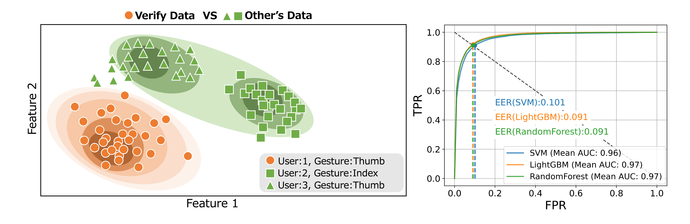
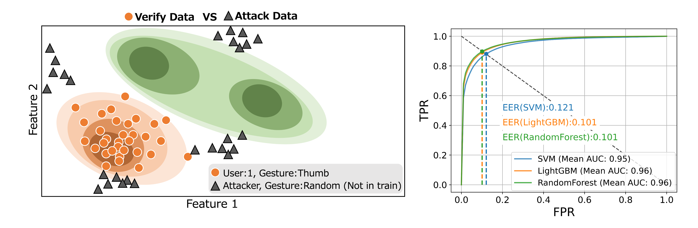
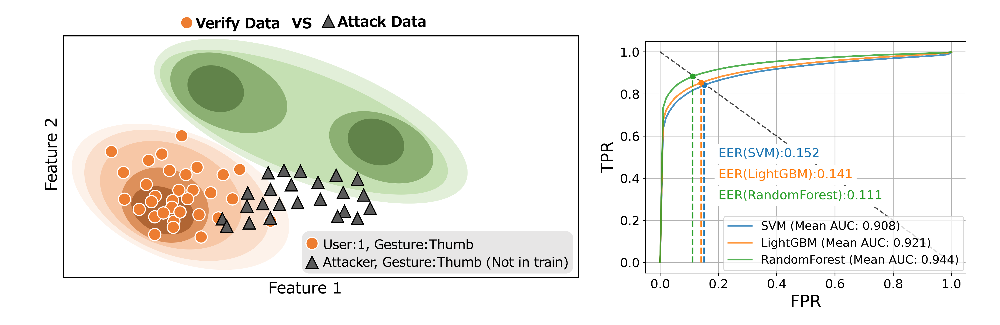

# biometric-verification-experiments

In this study, we present a cost-effective method for sEMG authentication using a 1-channel sEMG sensor, a departure from prior research that relied on expensive medical devices with 32 or more channels. The process involved collecting sEMG data from 19 participants who performed 11 different types of gestures, which underwent preprocessing and feature extraction to construct and evaluate machine learning models. Our basic evaluation revealed high model accuracy (AUC=95%, EER=11%), with a robustness evaluation indicating a mere 1-2% reduction in AUC, demonstrating that the models are robust against assumed real-world attacks. This demonstrates the potential for high-accuracy, cost-effective sEMG authentication in practical applications.

### baseline experiment

In the baseline experiment, we collected sEMG data from 19 participants who performed 11 different types of gestures. The data underwent preprocessing and feature extraction to construct and evaluate machine learning models. Our basic evaluation revealed high model accuracy (AUC=95%, EER=11%) (Page 5).

### random attack experiment

In the random attack experiment, we evaluated the robustness of our models against random attacks. We found that the models are robust against these attacks, with only a 1-2% reduction in AUC (Page 6).

### imitation attack experiment

In the imitation attack experiment, we evaluated the robustness of our models against imitation attacks. We found that the models are robust against these attacks, with only a 1-2% reduction in AUC (Page 7).

